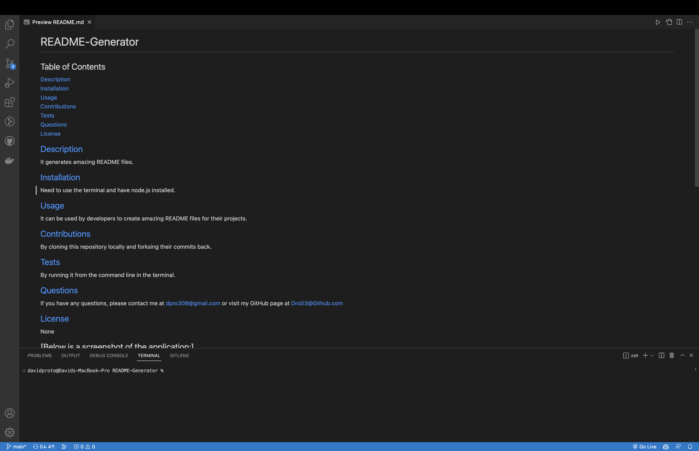

# README-Generator
  
  ## Table of Contents
  <a href="#description">Description</a> 
  <a href="#installation">Installation</a> 
  <a href="#usage">Usage</a> 
  <a href="#con">Contributions</a> 
  <a href="#tests">Tests</a> 
  <a href="#questions">Questions</a> 
  <a href="#license">License</a> 
  
  ## [Description](#description)
  It generates dynamic README files from the command line and uses node.js. 
  ## [Installation](#installation)
  Simply go to the command line on the terminal, have node.js installed and type node index.js 
  ## [Usage](#usage)
  It is used to make dynamic, professional README files 
  ## [Contributions](#con)
  Contributions can be made by forking the code to your local source and push up your changes 
  ## [Tests](#tests)
  It can be tested by running the node index.js command line in the terminal
  ## [Questions](#questions)
  If you have any questions, please contact me at dpro308@gmail.com or visit my GitHub page at
  [Github.com/Dpro03](undefined)
  ## [License](#license)
  None 
  ## Below is a screenshot of the application
  
  ## Below is a link to the video showing the application in action

  https://drive.google.com/file/d/1JbFNtuZkmBbEuw6eZJO9N0PJ9DMn-ACH/view
  
  